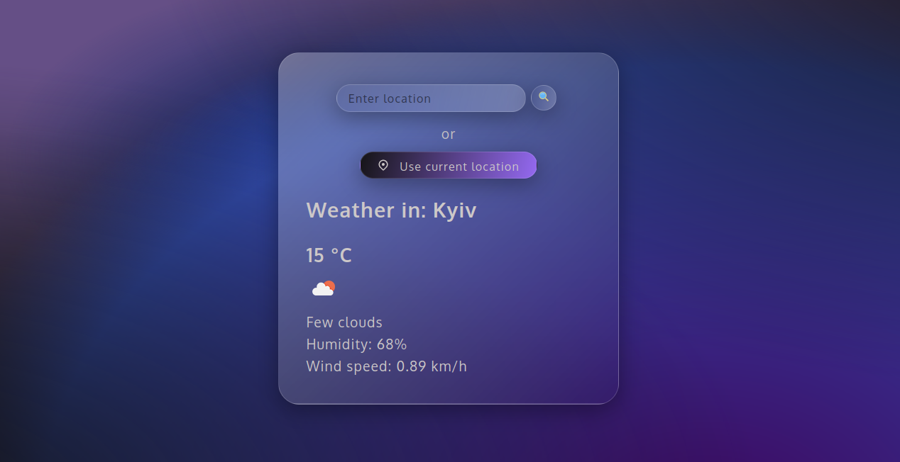

<h1 align="center">Weather App</h1>

## Description

This weather app is a simple tool for obtaining current weather forecasts. It uses the openweathermap API to provide up-to-date weather information. Users can access the weather in their current location through geolocation or search for the weather in any other location by entering the name in the search field.

## Tools

- HTML5,
- CSS,
- JS
