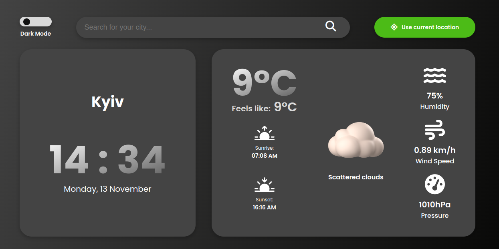

<h1 align="center">Weather App</h1>

## Description

This is a simple weather application that provides current weather information. With this app, you can check the weather for cities you input into the search bar or find out the weather at your current location by using the "Use Current Location" button.

It features a responsive design, catering to various devices such as mobile phones, tablets, desktops, and large desktop screens through the use of media queries.

Additionally, the application offers two themes – a light theme and a dark theme, allowing users to choose their preferred visual style.

## Tools

- HTML5,
- CSS,
- JS
